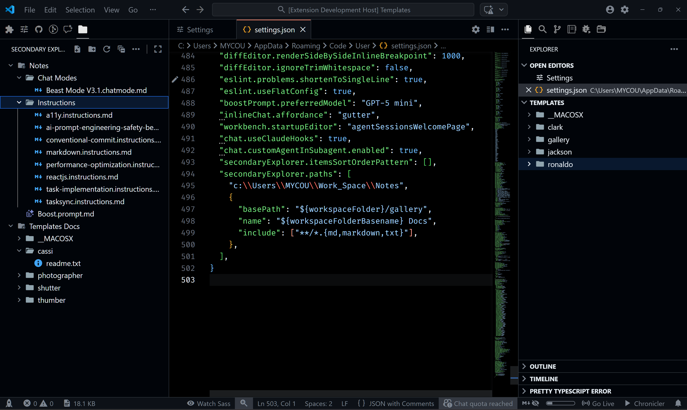

##  Secondary Explorer

> Adds a secondary explorer view to manage files and folders, create, view, rename, delete, cut, copy, paste, and more—outside the default workspace explorer.

---

[](https://buymeacoffee.com/r35007)

## Preview



---

## Features

- 📁 **Secondary Explorer View**: Manage files and folders in a dedicated sidebar.
- 🗂️ **Multi-Folder Support**: Display and organize multiple local folders.
- 🔀 **Tree/List Toggle**: Switch between hierarchical tree and flat list views.
-  **File & Folder Operations**: Create, view, rename, delete files/folders.
- 🔎 **Pattern Filtering**: Filter files/folders per root using include/exclude glob patterns (e.g., show only Markdown files: `*.md`).
- ✂️ **Cut, Copy, Paste**: Move or duplicate files/folders.
- 🗂️ **Multi-Selection Support**: Supports Multi file or folder selection for Cut, Copy, Paste and Delete operations.
- 🗂️ **Reveal & Copy Path**: Reveal in File Explorer, copy absolute/relative paths.
- 🪟 **Open Folder in New Window**: Open any folder in a new VS Code window.
- 🖉 **Improved Rename**: Renaming a folder updates open editors.
- 🔄 **Quick Actions**: Refresh, open settings, and perform file operations.
- 🗑️ **Remove Folder**: Remove a configured root folder (does not delete from disk).
- 🧭 **Quick Add**: Add selection to Secondary Explorer from the default explorer/editor context menu.

---

## Getting Started

### Installation

1. Open the Extensions view in VS Code (`Ctrl+Shift+X`).
2. Search for `Secondary Explorer`.
3. Click **Install**.

### Activation

The extension activates automatically on startup and adds a new "Secondary Explorer" view to the sidebar.

---

## Usage

### Adding Folders

1. Click the **Secondary Explorer** icon in the sidebar.
2. If no folders are configured, click **Add Folder to Explorer** or use the command palette (`Ctrl+Shift+P`) and run `Secondary Explorer: Settings`.
3. Add local folder paths to display in the secondary explorer.

### File & Folder Operations

- **New File/Folder**: Use the toolbar or context menu to create file or folders.
- **Rename/Delete**: Right-click to renaming a file or folder.
- **Cut/Copy/Paste**: Use context menu or keyboard shortcuts to move or duplicate files/folders.
- **Reveal in File Explorer**: Right-click to reveal any file/folder in your OS file explorer.
- **Copy Path/Relative Path**: Right-click to copy absolute or relative path to clipboard.
- **Open Folder in New Window**: Right-click any file or folder to open it in a new VS Code window.
- **Open In Integrated Terminal**: Right-click any file or folder to open it in a VS Code Integrated Terminal.
- **Open File**: Click or Enter to open files.

### Keyboard Shortcuts

- `Delete`: Remove selected file or folder (when focused in Secondary Explorer).
- `Ctrl+X`: Cut selected file or folder
- `Ctrl+C`: Copy selected file or folder
- `Ctrl+V`: Paste into selected folder
- `F2`: Rename selected file or folder

You can also toggle the view mode from the view title toolbar:

- View as List / View as Tree

---

## Configuration

Configure folders to display via VS Code settings:

```jsonc
// settings.json
"secondaryExplorer.paths": [
  // Simple string paths (support ${workspaceFolder} and ${userHome})
  "${workspaceFolder}/docs",
  "${userHome}/notes",
  "C:/path/to/folder",
  "C:/path/to/folder/file.txt",

  // Or rich objects with filtering and custom name
  {
    "basePath": "${workspaceFolder}",
    "name": "Workspace",
    "include": ["*.md", "*.txt"],
    "exclude": ["node_modules", "dist", "build", "out"]
  }
]
```

- **Workspace-level configuration recommended.**

Notes:

- Paths must be absolute and exist on disk to render.
- Include/Exclude accept glob patterns; include is applied to files, and folders are expanded only if children match include.
- Variable interpolation is supported in string and object forms: ${workspaceFolder}, ${userHome}.

---

## Acknowledgements

Built by [Sivaraman](mailto:sendmsg2siva@gmail.com) — MIT License.

---

> **TIP**
> For more details, see the [CHANGELOG.md](CHANGELOG.md) and [LICENSE.md](LICENSE.md) files.
