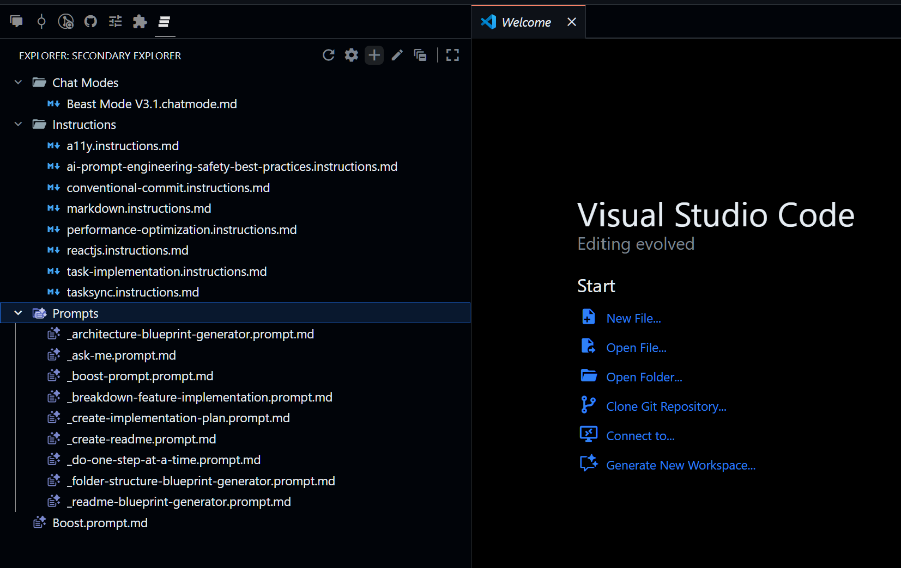

<table>
	<tr>
		<td></td>
		<td><h1>Secondary Explorer</h1></td>
	</tr>
</table>

<a href="https://buymeacoffee.com/r35007" target="_blank">
	
</a>

> Adds a secondary explorer view to manage files and folders—create, view, rename, and delete—outside the default workspace explorer.

---

## Preview


---

## Features

- 📁 **Secondary Explorer View**: Manage files and folders in a dedicated sidebar, separate from the default workspace explorer.
- 🗂️ **Multi-Folder Support**: Configure multiple local folders to display and organize.
- 📝 **File & Folder Operations**: Create, view, rename, and delete files/folders directly from the secondary explorer.
- 🔄 **Quick Actions**: Refresh, open settings, and perform file operations with context menus and keybindings.

---

## Getting Started

### Installation

1. Open the Extensions view in VS Code (`Ctrl+Shift+X`).
2. Search for `Secondary Explorer`.
3. Click **Install**.

### Activation

The extension activates automatically on startup and adds a new "Secondary Explorer" view to the sidebar.

---

## Usage

### Adding Folders

1. Click the **Secondary Explorer** icon in the sidebar.
2. If no folders are configured, click **Pick a Folder** or use the command palette (`Ctrl+Shift+P`) and run `Secondary Explorer: Settings`.
3. Add local folder paths to display in the secondary explorer.

### File & Folder Operations

- **New File/Folder**: Use the toolbar or context menu to create entries.
- **Rename/Delete**: Right-click or use the toolbar for quick actions.
- **Open File**: Double-click or use the context menu to open files.

### Keyboard Shortcuts

- `Delete`: Remove selected file or folder (when focused in Secondary Explorer).

---

## Configuration

You can configure folders to display via VS Code settings:

```jsonc
// settings.json
"secondaryExplorer.folders": [
	"C:/path/to/folder1",
	"C:/path/to/folder2"
]
```

- **Workspace-level configuration recommended.**

---

## Troubleshooting

> [!IMPORTANT]
> If the Secondary Explorer view does not appear, reload the VS Code window or check your folder configuration in settings.

- Ensure folder paths are valid and accessible.
- For issues, check the [Issues](https://github.com/R35007/secondary-explorer-vscode-extension/issues) page on GitHub.

---


## Acknowledgements

Built by [Sivaraman](mailto:sendmsg2siva@gmail.com) — MIT License.

---

> [!TIP]
> For more details, see the [CHANGELOG.md](CHANGELOG.md) and [LICENSE.md](LICENSE.md) files.
